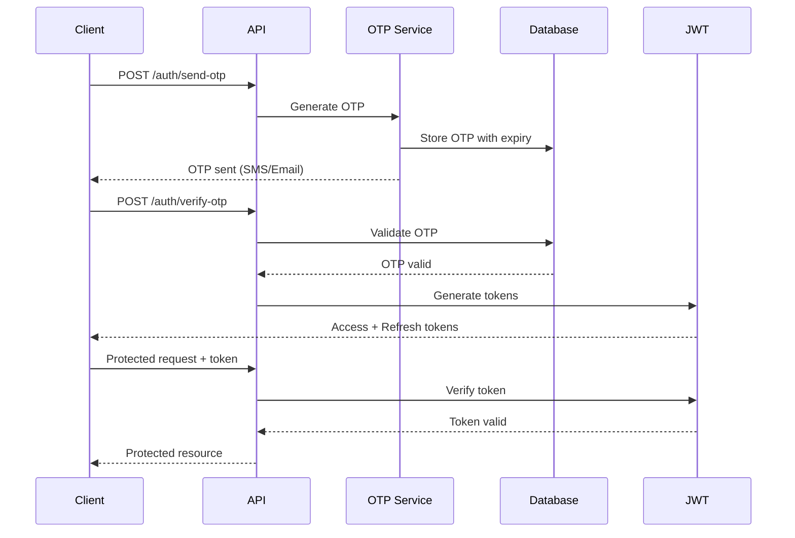

# 🥬 VegBox Backend

A robust, scalable Node.js backend API for VegBox - a vegetable delivery platform with real-time order tracking capabilities.

[](https://www.typescriptlang.org/)
[](https://nodejs.org/)
[](https://expressjs.com/)
[](https://www.mongodb.com/)
[](https://socket.io/)

## 📋 Table of Contents

- [Features](#-features)
- [Tech Stack](#-tech-stack)
- [Project Structure](#-project-structure)
- [Getting Started](#-getting-started)
  - [Prerequisites](#prerequisites)
  - [Installation](#installation)
  - [Environment Variables](#environment-variables)
- [API Documentation](#-api-documentation)
  - [Authentication Endpoints](#authentication-endpoints)
  - [User Endpoints](#user-endpoints)
  - [Admin Endpoints](#admin-endpoints)
- [Architecture](#-architecture)
- [Development](#-development)
- [Deployment](#-deployment)
- [Contributing](#-contributing)
- [License](#-license)

## ✨ Features

- 🔐 **Secure Authentication** - OTP-based phone authentication with JWT tokens
- 👥 **Role-Based Access Control** - Customer, Driver, and Admin roles
- 🔄 **Real-time Updates** - WebSocket integration for live order tracking
- 📱 **RESTful API** - Clean, well-structured API endpoints
- 🛡️ **Security First** - Rate limiting, CORS, input validation with Zod
- 🎯 **Type Safety** - Full TypeScript implementation
- 🚀 **Scalable Architecture** - Modular design with separation of concerns
- ⚡ **Performance Optimized** - Async/await patterns with proper error handling

## 🛠️ Tech Stack

### Core
- **Runtime**: Node.js (ES Modules)
- **Language**: TypeScript 5.9.3
- **Framework**: Express.js 5.1.0
- **Database**: MongoDB with Mongoose ODM

### Key Dependencies
- **Authentication**: JWT (jsonwebtoken), bcrypt
- **Validation**: Zod 4.1.12
- **Real-time**: Socket.io 4.8.1
- **Security**: express-rate-limit, CORS
- **Utilities**: date-fns, uuid, dotenv

### Development Tools
- **Build Tool**: TypeScript Compiler (tsc)
- **Dev Server**: tsx with watch mode
- **Environment**: cross-env for cross-platform compatibility

## 📁 Project Structure

```
vegbox-backend/
├── config/                 # Configuration files
│   ├── app.config.ts      # Application configuration
│   ├── database.config.ts # MongoDB connection setup
│   └── http.config.ts     # HTTP status codes
├── controllers/           # Request handlers
│   ├── auth.controller.ts
│   ├── user.controller.ts
│   ├── driver.controller.ts
│   └── adminOrder.controller.ts
├── middlewares/           # Express middlewares
│   ├── asyncHandler.middleware.ts
│   ├── errorHandler.middleware.ts
│   ├── jwtAuth.middleware.ts
│   ├── role.middleware.ts
│   └── validate.middleware.ts
├── models/                # Mongoose schemas
│   ├── User.model.ts
│   ├── Order.model.ts
│   ├── Product.model.ts
│   └── Otp.model.ts
├── routes/                # API route definitions
│   ├── auth.routes.ts
│   ├── user.routes.ts
│   ├── driver.routes.ts
│   └── admin.routes.ts
├── services/              # Business logic layer
│   ├── auth.service.ts
│   └── otp.service.ts
├── socket/                # WebSocket handlers
│   └── orderSocket.ts
├── types/                 # TypeScript type definitions
├── utils/                 # Utility functions
│   ├── appError.ts
│   ├── get-env.ts
│   ├── jwt.ts
│   └── sms.provider.ts
├── validators/            # Zod validation schemas
│   └── auth.validator.ts
├── app.ts                 # Express app configuration
├── server.ts              # Server entry point
├── tsconfig.json          # TypeScript configuration
└── package.json           # Project dependencies
```

## 🚀 Getting Started

### Prerequisites

Before you begin, ensure you have the following installed:
- **Node.js** (v18 or higher)
- **npm** (v9 or higher)
- **MongoDB** (v6 or higher) - Running locally or cloud instance (MongoDB Atlas)
- **Git** (for version control)

### Installation

1. **Clone the repository**
   ```bash
   git clone <repository-url>
   cd vegbox-backend
   ```

2. **Install dependencies**
   ```bash
   npm install
   ```

3. **Set up environment variables**
   
   Create a `.env` file in the root directory:
   ```bash
   cp .env.example .env
   ```
   
   Then edit `.env` with your configuration (see [Environment Variables](#environment-variables))

4. **Start the development server**
   ```bash
   npm run dev
   ```

   The server will start on `http://localhost:5000` (or your configured PORT)

### Environment Variables

Create a `.env` file with the following variables:

```env
# Server Configuration
NODE_ENV=development
PORT=5000
BASE_PATH=/api

# Database
MONGO_URI=mongodb://localhost:27017/vegbox

# JWT Secrets (use strong, random strings in production)
JWT_ACCESS_SECRET=your-super-secret-access-key-change-this
JWT_REFRESH_SECRET=your-super-secret-refresh-key-change-this
JWT_ACCESS_EXPIRES_IN=30m
JWT_REFRESH_EXPIRES_IN=90d

# OTP Configuration
OTP_EXPIRES_MINUTES=5

# Frontend
FRONTEND_ORIGIN=http://localhost:3000
```

> ⚠️ **Security Note**: Never commit your `.env` file to version control. Use strong, unique secrets in production.

## 📚 API Documentation

Base URL: `http://localhost:5000/api`

### 🔐 Authentication Endpoints

#### 1. Send OTP
Request a 6-digit verification code.
- **Method:** `POST`
- **Path:** `/api/auth/send-otp`
- **Body:**
  ```json
  {
    "phone": "+919876543210",
    "role": "driver" 
  }
  ```
> [!NOTE]
> `role` is optional (defaults to "customer"). For first-time drivers/admins, specifying the role here is recommended.

#### 2. Verify OTP
Verify the code and receive JWT tokens.
- **Method:** `POST`
- **Path:** `/api/auth/verify-otp`
- **Body:**
  ```json
  {
    "phone": "+919876543210",
    "code": "123456",
    "role": "driver",
    "pin": "1234"
  }
  ```
> [!IMPORTANT]
> For **Drivers** and **Admins**: Providing a `pin` here will set or update your login PIN.

#### 3. Login with PIN
Quick login for Drivers and Admins using their set PIN.
- **Method:** `POST`
- **Path:** `/api/auth/login-with-pin`
- **Body:**
  ```json
  {
    "phone": "+919876543210",
    "pin": "1234"
  }
  ```

---

### 👤 User Endpoints (All Roles)
Requires `Authorization: Bearer <token>`

#### 1. Get Profile
- **Method:** `GET`
- **Path:** `/api/user/me`

---

### 🚚 Driver Endpoints
Requires `Authorization: Bearer <token>` and `role: "driver"`

#### 1. Get My Assigned Orders
- **Method:** `GET`
- **Path:** `/api/orders/driver/my-orders`
- **Query Params:** `?deliveryStatus=out_for_delivery` (optional)

#### 2. Update Delivery Status
- **Method:** `PUT`
- **Path:** `/api/orders/driver/update-status/:orderId`
- **Body:** `{ "status": "delivered" }`
- **Allowed Statuses:** `out_for_delivery`, `delivered`, `failed`

#### 3. Toggle Online Status
Set yourself available or unavailable for assignments.
- **Method:** `PUT`
- **Path:** `/api/drivers/toggle-online`
- **Body:** `{ "isOnline": true }`

#### 4. Signal Reached Store
Clear your "Returning" status and become available for new orders.
- **Method:** `PUT`
- **Path:** `/api/drivers/reached-store`

---

### 🛠️ Admin Endpoints
Requires `Authorization: Bearer <token>` and `role: "admin"`

#### 1. List All Orders
- **Method:** `GET`
- **Path:** `/api/orders/all`
- **Query Params:** `?status=confirmed&deliveryStatus=pending` (optional)

#### 2. Get All Drivers
Fetch all drivers with their real-time availability and busy status.
- **Method:** `GET`
- **Path:** `/api/drivers/all`

#### 3. Get Free Drivers
Fetch drivers who are online and not currently busy.
- **Method:** `GET`
- **Path:** `/api/drivers/free`

#### 4. Assign Driver to Order
- **Method:** `PUT`
- **Path:** `/api/orders/assign-driver/:orderId`
- **Body:** `{ "driverId": "user_id_here" }`

#### 5. Update Order/Delivery Status
- **Method:** `PUT`
- **Path:** `/api/orders/update-status/:orderId`
- **Body:** 
  ```json
  { 
    "status": "ready", 
    "deliveryStatus": "assigned" 
  }
  ```

---

### 🔄 Order Status Reference

| Status Type | Allowed Values |
| :--- | :--- |
| **Order (Life Cycle)** | `pending`, `confirmed`, `preparing`, `ready`, `cancelled`, `failed` |
| **Delivery** | `pending`, `assigned`, `out_for_delivery`, `delivered`, `cancelled`, `failed` |

---

### 🏁 Driver Workflow Guide

1. **Go Online:** Login and call `/api/drivers/toggle-online` with `isOnline: true`.
2. **Accept Order:** Admin assigns an order. Your `deliveryStatus` becomes `assigned`. You are now `isBusy: true`.
3. **Out for Delivery:** Call `/api/orders/driver/update-status/:id` with `status: "out_for_delivery"`.
4. **Deliver:** Call `/api/orders/driver/update-status/:id` with `status: "delivered"`.
5. **Return to Store:** Upon last delivery, your `isReturning` status becomes `true`. You cannot receive new orders.
6. **Arrive at Base:** Call `/api/drivers/reached-store`. You are now available again!

## 🏗️ Architecture

### Layered Architecture

The application follows a clean, layered architecture:

```
┌─────────────────────────────────────┐
│         Routes Layer                │  ← API Endpoints
├─────────────────────────────────────┤
│      Middlewares Layer              │  ← Auth, Validation, Error Handling
├─────────────────────────────────────┤
│      Controllers Layer              │  ← Request/Response Handling
├─────────────────────────────────────┤
│       Services Layer                │  ← Business Logic
├─────────────────────────────────────┤
│        Models Layer                 │  ← Data Models & Database
└─────────────────────────────────────┘
```

### Key Design Patterns

- **Middleware Pattern**: Composable request processing pipeline
- **Service Layer Pattern**: Business logic separation from controllers
- **Repository Pattern**: Data access abstraction via Mongoose models
- **Error Handling**: Centralized error handling with custom AppError class
- **Async Wrapper**: Automatic error catching for async route handlers

### Authentication Flow



## 💻 Development

### Available Scripts

```bash
# Development with auto-reload
npm run dev

# Development with watch mode
npm run dev:watch

# Build for production
npm run build

# Start production server
npm start
```

### Code Style

This project uses TypeScript with strict mode enabled. Key conventions:

- **ES Modules**: Use `import/export` syntax
- **Async/Await**: Prefer async/await over callbacks
- **Error Handling**: Use try/catch with centralized error handler
- **Type Safety**: Leverage TypeScript types and interfaces
- **Validation**: Use Zod schemas for input validation

### Adding New Features

1. **Create Model** (if needed) in `models/`
2. **Define Validation Schema** in `validators/`
3. **Implement Service Logic** in `services/`
4. **Create Controller** in `controllers/`
5. **Define Routes** in `routes/`
6. **Register Routes** in `app.ts`

### Testing

```bash
# Run tests (when implemented)
npm test

# Run tests in watch mode
npm run test:watch
```

## 🚢 Deployment

### Production Build

```bash
# Build TypeScript to JavaScript
npm run build

# Start production server
npm start
```

### Environment Setup

1. Set `NODE_ENV=production` in your environment
2. Use strong, unique secrets for JWT tokens
3. Configure MongoDB connection string for production database
4. Set appropriate CORS origins
5. Enable rate limiting and security headers


## 📄 License

This project is licensed under the WebIntegratorz License.

## 👨‍💻 Author

**[WebIntegratorz](https://webintegratorz.com/) Team**

## 🙏 Acknowledgments

- Express.js community for excellent documentation
- MongoDB team for Mongoose ODM
- Socket.io for real-time capabilities
- TypeScript team for type safety

---

<div align="center">
  <strong>Built with ❤️ for fresh vegetable delivery</strong>
</div>
